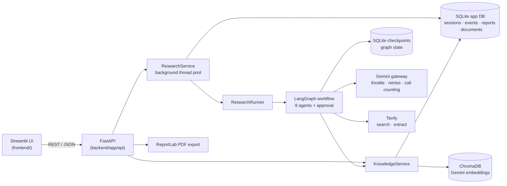
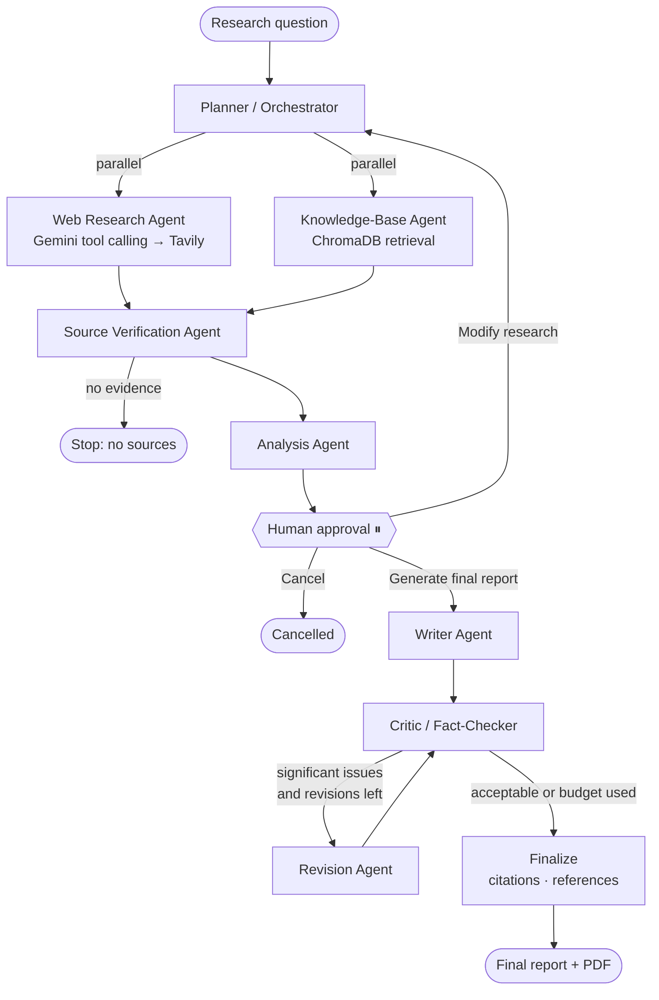

# ResearchPilot

**Multi-Agent AI Research & Report Generation System**

ResearchPilot is an agentic research assistant. Give it a research question and a team of
specialised AI agents plans the research, searches the web and your own documents in
parallel, verifies and cross-checks the sources, analyses the evidence, pauses for your
approval, writes a structured report, fact-checks it, revises it if needed, and exports it
as a cited PDF.

It is built with **LangGraph**, **Gemini**, **Tavily**, **ChromaDB**, **FastAPI** and
**Streamlit**, and is designed to run on the **Gemini free tier**.

---

## Contents

1. [Problem statement](#1-problem-statement)
2. [Objectives](#2-objectives)
3. [Features](#3-features)
4. [Architecture](#4-architecture)
5. [Multi-agent workflow](#5-multi-agent-workflow)
6. [Technologies](#6-technologies)
7. [Installation](#7-installation)
8. [Environment variables](#8-environment-variables)
9. [Running the application](#9-running-the-application)
10. [Example workflow](#10-example-workflow)
11. [API reference](#11-api-reference)
12. [Testing](#12-testing)
13. [Screenshots](#13-screenshots)
14. [Project structure](#14-project-structure)
15. [Known limitations](#15-known-limitations)
16. [Future improvements](#16-future-improvements)

---

## 1. Problem statement

A single LLM call can produce a confident answer to a research question, but not a
trustworthy one: it may rely on stale training data, invent sources, ignore the user's own
documents and give no indication of how well each claim is supported.

Real research is a process — scoping the question, gathering evidence from several places,
checking sources against each other, synthesising, writing, and reviewing. ResearchPilot
models that process explicitly as a graph of cooperating agents with shared, persistent
state, human oversight at the expensive step, and citations that are traceable to the
evidence actually collected.

## 2. Objectives

- Demonstrate **real agentic AI**: planning, tool calling, parallel agents, conditional
  routing, a critic/revision loop and human-in-the-loop control — not a chatbot wrapper.
- Ground every report in **retrieved evidence** (web + local knowledge base) with
  **citations that cannot be fabricated**.
- Be **honest about evidence quality**: label sources as corroborated, single-source,
  conflicting or unverified — never "true".
- Be **robust**: a failing agent or API must not crash the run; interrupted runs resume
  from a checkpoint.
- Run comfortably within **free-tier API limits**.

## 3. Features

| Area | What ResearchPilot does |
|---|---|
| Multi-agent orchestration | 8 specialised agents coordinated by a LangGraph state machine |
| Planning | Breaks the question into sub-questions and search queries; decides which research branches to run |
| Tool calling | Gemini decides which Tavily searches/extractions to run; the system executes them within a budget |
| Web research | Tavily search + page extraction with retries, de-duplication and credit limits |
| RAG | Upload PDF/TXT/Markdown → page-aware chunking → Gemini embeddings → ChromaDB retrieval |
| Parallelism | Web research and knowledge-base retrieval run concurrently and merge into shared state |
| Source verification | Relevance and reliability ratings; corroborated / single-source / conflicting / unverified labels |
| Critic / revision loop | Deterministic citation checks + LLM fact-checking; bounded revision loop |
| Human-in-the-loop | The run pauses after research; you approve, request changes, or cancel |
| Persistence | SQLite for sessions, live events, reports, documents; SQLite checkpoints for graph state |
| Resumability | Quota errors, outages and restarts stop runs safely; *Retry* continues from the failed step |
| Citations | Inline `[W1]`/`[K2]` citations restricted to collected evidence; unknown IDs are removed |
| Reports | Markdown in the UI and a downloadable PDF with linked, verification-labelled references |
| UI | Streamlit dashboard with live workflow stages, approval panel, history, knowledge base, settings |
| Free-tier protection | Shared RPM throttle, call counting, search budget, evidence selection, single retries |

## 4. Architecture



- **The UI never calls an LLM.** It reads everything from the REST API, so the stages it
  shows are the backend's real state (recorded events + the checkpoint's next steps).
- **One Gemini gateway** is shared by all runs, so `GEMINI_MAX_RPM` is respected globally.
- **Persistence is SQLAlchemy-based**; switching `DATABASE_URL` to PostgreSQL requires no
  code changes in the services.

## 5. Multi-agent workflow



| Agent | Responsibility | Output |
|---|---|---|
| **Planner** | Objective, 2–4 research questions, 2–4 search queries, which branches to run | `ResearchPlan` |
| **Web Research** | Gemini chooses Tavily searches/extractions (≤ 2 rounds, ≤ `MAX_WEB_SEARCHES`) | Web sources `W1…` |
| **Knowledge Base (RAG)** | Semantic retrieval per research question (no generation calls) | KB sources `K1…` |
| **Source Verification** | Relevance, reliability, claim corroboration and conflicts | Evidence with status labels |
| **Analysis** | Findings with source IDs, patterns, comparisons, gaps | `AnalysisNotes` |
| **Writer** | Full 10-section report from the strongest `WRITER_MAX_SOURCES` sources | `ResearchReport` |
| **Critic** | Exact citation checks + LLM review of unsupported claims | `Critique` |
| **Revision** | Fixes high/medium issues using only existing evidence | Revised report |

**Routing rules (deterministic, not left to the LLM):**

- Revision runs only if the critic finds a high-severity issue or ≥ 3 medium issues **and**
  the revision budget (`MAX_REVISIONS`, default 1) is not used up — the loop always ends.
- "Modify research" is allowed `MAX_RESEARCH_ITERATIONS − 1` times; later requests proceed to writing.
- Optional agents degrade gracefully (e.g. analysis unavailable → the writer uses raw evidence);
  a writer failure or Gemini quota error **stops the run resumably** at that step.

**Report sections:** Title · Executive Summary · Introduction · Research Questions ·
Methodology (generated from what the run actually did) · Key Findings · Detailed Analysis ·
Limitations · Conclusion · References (generated from evidence, never by the LLM).

## 6. Technologies

| Layer | Technology |
|---|---|
| Orchestration | LangGraph 1.2 (StateGraph, conditional edges, `interrupt`, SQLite checkpointer) |
| LLM | Google Gemini (`gemini-3.5-flash` by default) via `langchain-google-genai` |
| Embeddings | `gemini-embedding-001` (768 dimensions) |
| Vector store | ChromaDB (cosine) via `langchain-chroma` |
| Web search | Tavily via `langchain-tavily` |
| Backend | FastAPI, Pydantic v2, SQLAlchemy 2.0, SQLite |
| Frontend | Streamlit 1.64 |
| PDF | ReportLab |
| Tooling | `uv` (locked dependencies), pytest, pyflakes |

## 7. Installation

Requirements: **Python 3.11** and [**uv**](https://docs.astral.sh/uv/).

```bash
git clone <your-repo-url> ResearchPilot
cd ResearchPilot
uv sync --locked            # creates .venv with the exact locked versions
cp .env.example .env        # Windows: copy .env.example .env
```

Then add your API keys to `.env`:

- **Gemini**: free key from <https://aistudio.google.com/apikey>
- **Tavily**: free key from <https://app.tavily.com> (a basic search costs 1 credit)

> `.env` is git-ignored. Never commit it. On the Gemini free tier, Google may use prompts to
> improve its products — do not upload confidential documents.

## 8. Environment variables

All settings live in `.env` (see `.env.example`). Only the two keys are required.

| Variable | Default | Purpose |
|---|---|---|
| `GEMINI_API_KEY` | — | **Required.** Gemini generation + embeddings |
| `TAVILY_API_KEY` | — | Web research (without it, research uses the knowledge base only) |
| `GEMINI_MODEL` | `gemini-3.5-flash` | Chat model (checked at `/health/models`) |
| `GEMINI_EMBEDDING_MODEL` | `gemini-embedding-001` | Embedding model |
| `GEMINI_MAX_RPM` | `8` | Client-side Gemini requests/minute (shared by all runs) |
| `MAX_WEB_SEARCHES` | `3` | Tavily searches per research iteration |
| `MAX_RESEARCH_TOOL_ROUNDS` | `2` | Tool-calling rounds for the web agent |
| `MAX_REVISIONS` | `1` | Critic → revision loop limit |
| `MAX_RESEARCH_ITERATIONS` | `2` | Research iterations including "Modify research" |
| `WRITER_MAX_SOURCES` | `14` | Strongest verified sources given to the writer |
| `RAG_TOP_K` / `RAG_MIN_RELEVANCE` | `4` / `0.6` | Chunks per question / cosine relevance cut-off |
| `CHUNK_SIZE` / `CHUNK_OVERLAP` | `1000` / `150` | Document chunking (characters) |
| `MAX_UPLOAD_MB` | `20` | Upload size limit |
| `DATABASE_URL` | `sqlite:///data/researchpilot.db` | App database (PostgreSQL-compatible URL) |
| `CHECKPOINT_DB` | `data/checkpoints.db` | LangGraph checkpoints |
| `BACKEND_URL` | `http://127.0.0.1:8000` | Where the UI finds the API |

## 9. Running the application

```bash
python run.py all          # backend (port 8000) + UI (http://localhost:8501)
```

Or separately:

```bash
python run.py backend      # FastAPI — interactive docs at http://127.0.0.1:8000/docs
python run.py frontend     # Streamlit UI at http://localhost:8501
```

Verify your Gemini setup (one tiny request):
`GET http://127.0.0.1:8000/health/models?probe=true`. If the model is unavailable, the
response suggests compatible Flash models. The app's **Settings** page shows the
active model, knowledge-base status and overall system status.

Terminal mode (no UI):

```bash
python run.py research "What are the benefits and limitations of RAG?"
python run.py research --retry <run_id>     # continue a stopped run
```

> Run the backend as a **single process** (the default). Background runs live in that process.

## 10. Example workflow

1. **Knowledge Base** → upload `internal_notes.pdf`. It is chunked, embedded and indexed.
2. **New Research** → *"What are the main benefits and limitations of Retrieval-Augmented
   Generation?"* → **Start Research →**.
3. Watch the stages update live: *Planning → Web Research ∥ Knowledge Retrieval → Source
   Verification → Analysis*. The activity log shows each agent's result (e.g. "3 web
   searches, 14 new sources", "1 relevant chunk from 1 document").
4. The run pauses at **Review Before Report Generation** (the human-in-the-loop checkpoint) with source counts, research questions and key findings:
   - **Approve & Continue** → writer → critic → (revision) → finalize
   - **Request Changes** → e.g. *"Add evidence on cost and latency"* → the planner re-plans
     and only new queries are searched
   - **Cancel**
5. Read the **Research Report**, use **View Sources** (each with its verification label),
   and **Download PDF**.
6. Reopen any run later from **History**. If a run stopped (quota, outage, restart),
   open it and click **Retry from checkpoint**.

**Typical cost per run:** ~7–10 Gemini calls, ≤ 3 Tavily credits (basic search), and a few
embedding requests — well within free-tier limits.

## 11. API reference

Full interactive docs: `http://127.0.0.1:8000/docs`.

| Method & path | Description |
|---|---|
| `GET /health` | Service, database and key status (never returns keys) |
| `GET /health/models?probe=` | Gemini model availability (+ optional 1-request probe) |
| `GET /health/config` | Non-secret runtime configuration |
| `POST /knowledge/documents` | Upload (and index) a PDF/TXT/Markdown file |
| `GET /knowledge/documents` · `GET /knowledge/documents/{id}` | List / get documents |
| `POST /knowledge/documents/{id}/process` | Re-process a document |
| `DELETE /knowledge/documents/{id}` | Delete a document, its file and its embeddings |
| `POST /knowledge/search` | Semantic search over the knowledge base |
| `POST /research` | Start a research run (202, runs in the background) |
| `GET /research` | Research history |
| `GET /research/{id}?after_event=N` | Status, new progress events, approval request, statistics |
| `POST /research/{id}/decision` | `{"action": "approve" \| "modify" \| "cancel", "feedback": "..."}` |
| `POST /research/{id}/retry` | Continue a stopped run from its checkpoint |
| `GET /research/{id}/report` | Final report (JSON + Markdown) |
| `GET /research/{id}/report.pdf` | Final report as PDF |
| `DELETE /research/{id}` | Delete a session, its events, report, PDF and checkpoints |

Errors are JSON `{"error": "...", "detail": "..."}` with meaningful status codes
(404 not found, 409 invalid state transition, 422 invalid input, 429 rate limit,
502 upstream failure, 503 missing configuration).

## 12. Testing

```bash
uv run pytest                          # full offline suite
uv run python -m pyflakes backend frontend run.py
```

The suite makes **no Gemini or Tavily calls**. External services are replaced at their
boundaries by scripted fakes that return real Pydantic objects, so agents, routing, state
reducers, checkpointing, the API, PDF generation and the UI all run for real:

| Area | Examples |
|---|---|
| Configuration & persistence | settings validation, secrets never serialised, repositories, migrations-free status values |
| Tools & RAG | Tavily error mapping and budgets, PDF/text loading, chunking, real ChromaDB retrieval |
| LLM gateway | call counting, single retry, daily-quota fail-fast, malformed-output repair |
| Agents | planner fallback, tool-call execution, verification statuses, citation checks, evidence selection |
| Workflow | parallel fan-out/fan-in, approval pause/resume, modify/cancel, bounded revision loop, quota stop + resume after restart |
| Service & API | background runs, live events, 409/404/422/503 handling, history, report + PDF download |
| PDF | sections, linked references, verification labels, escaping, pagination |
| Frontend | API client against the real app, stage derivation, headless Streamlit UI tests (AppTest) |

## 13. Screenshots

> _Add screenshots here before submission._

| | |
|---|---|
| New Research & live workflow stages | `docs/screenshots/new-research.png` |
| Human approval panel | `docs/screenshots/approval.png` |
| Final report & sources | `docs/screenshots/report.png` |
| PDF export | `docs/screenshots/pdf.png` |
| Research history | `docs/screenshots/history.png` |
| Knowledge base | `docs/screenshots/knowledge-base.png` |

## 14. Project structure

```
ResearchPilot/
├── backend/
│   ├── app/
│   │   ├── agents/      # planner, web_researcher, rag_researcher, source_verifier, analyst,
│   │   │                # writer, critic, reviser, evidence_selection, llm gateway, prompts
│   │   ├── graph/       # state, builder, routing, human-review/finalize nodes, checkpointer, runner
│   │   ├── tools/       # Tavily web search/extract tools
│   │   ├── rag/         # loader, chunker, quota-aware embeddings, Chroma vector store
│   │   ├── services/    # research & knowledge services, model check, report render/PDF
│   │   ├── database/    # engine, ORM models, repositories
│   │   ├── models/      # API schemas, domain models, agent output schemas
│   │   ├── api/         # FastAPI routers
│   │   ├── config/      # settings
│   │   ├── utils/       # retry + Gemini error classification
│   │   ├── cli.py       # terminal workflow
│   │   └── main.py      # app factory
│   └── tests/           # offline test suite
├── frontend/
│   ├── streamlit_app.py # entry point + navigation
│   ├── views/           # New Research, History, Knowledge Base, Settings
│   ├── components.py    # stage tracker, approval panel, report view
│   ├── workflow.py      # stage state derived from backend data
│   └── api_client.py    # REST client
├── data/                # uploads, ChromaDB, SQLite (git-ignored)
├── reports/             # generated PDFs (git-ignored)
├── .env.example
├── pyproject.toml / uv.lock
└── run.py
```

## 15. Known limitations

- **Gemini availability.** During development, the newest Flash models frequently returned
  `503 high demand`, most often for the largest structured outputs (analysis and the full
  report). ResearchPilot handles this safely — analysis degrades, the writer stops resumably
  and **Retry** continues later — but a run cannot finish while the model refuses requests.
  If it persists, switch `GEMINI_MODEL` to another available Flash model (see
  `/health/models`) or retry later.
- **Live end-to-end coverage.** Planning, tool calling, parallel web + knowledge-base
  research, verification, the approval pause and checkpoint resume were verified against
  the real APIs. Because of the 503s above, the writer → critic → revision → finalize path
  has so far been verified with the scripted test suite rather than a completed live run.
- **Verification is corroboration, not truth.** Labels describe agreement between collected
  sources and publisher reliability; they do not establish that a claim is true.
- **Single backend process.** Background runs and the shared rate limiter live in one
  process; use one uvicorn worker.
- **No OCR.** Scanned/image-only PDFs are rejected with a clear message.
- **No authentication.** Intended for local use; the UI binds to `localhost`.
- **PDF fonts.** Built-in PDF fonts cover Latin text; other scripts are replaced safely.

## 16. Future improvements

- Fallback model routing for `503` responses and smaller sectioned report generation
- PostgreSQL + a task queue (e.g. Celery/RQ) for multi-worker deployments
- Streaming partial report text to the UI
- Authentication and per-user workspaces
- OCR for scanned PDFs and more document formats (DOCX, HTML)
- Source credibility signals (domain reputation, publication date weighting)
- Evaluation harness for report faithfulness and citation precision
